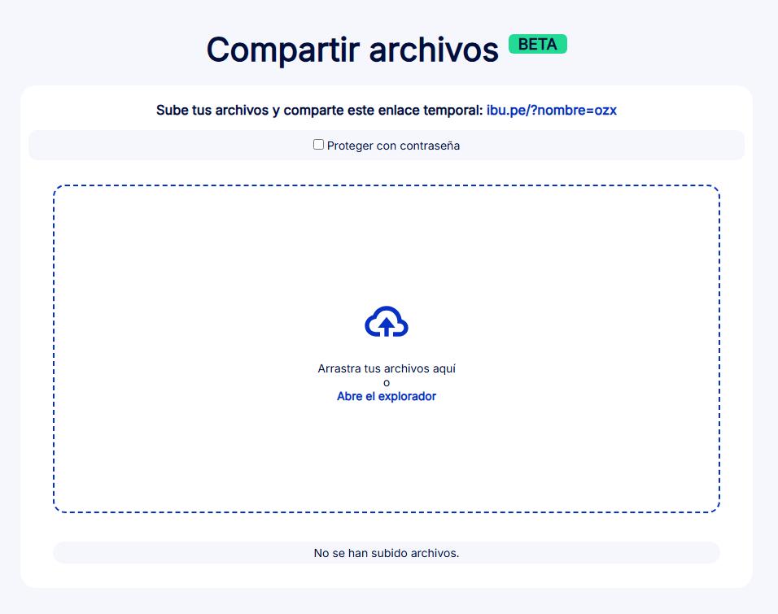

# Caso Práctico - Desarrollo Frontend

[](https://developer.mozilla.org/es/docs/Web/JavaScript)
[](https://www.php.net/)
[](https://developer.mozilla.org/es/docs/Web/HTML)
[](https://developer.mozilla.org/es/docs/Web/CSS)

Repositorio con la solución frontend para el caso práctico de desarrollo web. Implementación de interfaz responsive y funcionalidades interactivas con integración backend PHP.

## Screenshots

<p align="center">
  
</p>

## 📌 Características principales

- Diseño responsive y adaptable a diferentes dispositivos
- Interfaz de usuario intuitiva y moderna
- Componentes interactivos y dinámicos
- Integración con backend PHP
- Optimización de rendimiento frontend
- Gestión de estados eficiente

## � Tecnologías Backend
- PHP 7.4+ para lógica de servidor
- Posibilidad de integración con bases de datos MySQL/MariaDB
- Manejo de peticiones HTTP

## 🚀 Instalación y uso

Requisitos:
- Node.js 14+
- PHP 7.4+
- Servidor web (Apache/Nginx)

1. Clonar el repositorio:
```bash
git clone https://github.com/SakuWar/Caso_C_Front.git
```
